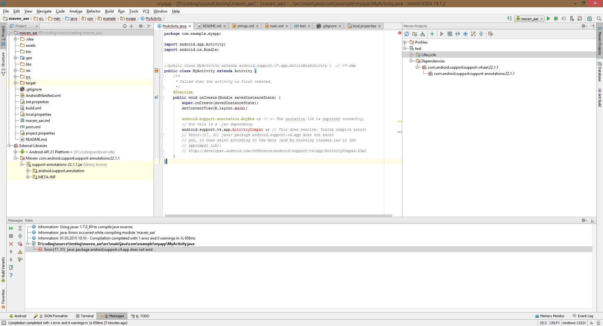

Example project for demonstrating faulty import of android support v4 library in an
IntelliJ IDEA 14.1.2 maven-enabled project.

The project was created with

`File > New > Project > Android > Application module...`

After the project was created, maven support was added by right clicking on the project
root in the project window and select `Add framework support... > maven`. Dependencies
was then added manually by modifying `pom.xml`

My local maven is configured with three local repo's. 

 1. The default one in %UserProfile%\.m2
 2. The one in %ANDROID_HOME%\extras\android\m2repository\
 3. The one in %ANDROID_HOME%\extras\google\m2repository

Full `settings.xml` : 

```
  
    <settings>
     <profiles>
       <profile>
         <id>myprofile</id>
         <repositories>
           <repository>
             <id>android-sdk-repo</id>
             <name>Android SDK repo</name>
             <url>file:///D:\coding\android-sdk\extras\google\m2repository</url>
           </repository>  
           <repository>
            <id>android-sdk-repo2</id>
             <name>Android SDK repo2</name>
             <url>file:///D:\coding\android-sdk\extras\android\m2repository</url>
           </repository>     
           <repository>
             <id>default</id>
             <name>Default</name>
             <url>file:///C:\Users\Frode\.m2\repository</url>
           </repository>
         </repositories>
       </profile>
     </profiles>

     <activeProfiles>
       <activeProfile>myprofile</activeProfile>
     </activeProfiles>
    </settings>
```

Illustrating screenshot:



OS: 
Windows 8.1
